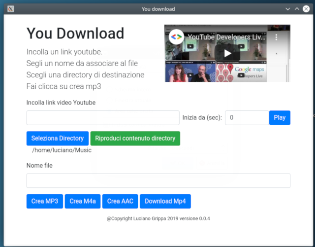

# You Download

    This project is a GUI interface for extract audio tracks from video url.
   In current release just YouTube video, but for the future i'm planning to allow download from Hls playlist, Dash manifest and mp4 urls.

## Authors

* **Luciano Grippa** - *contacts* - [Email](mailto:grippa.luciano@gmail.com)
* **Social** - *twitter* - [@lgrippa75](https://twitter.com/lgrippa75)

## License

This project is licensed under the MIT License - see the [LICENSE.md](LICENSE.md) file for details